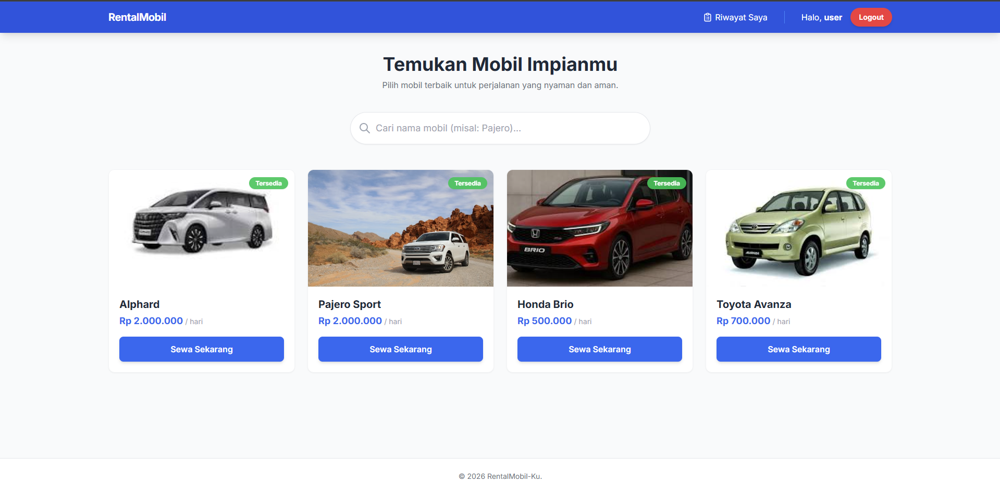
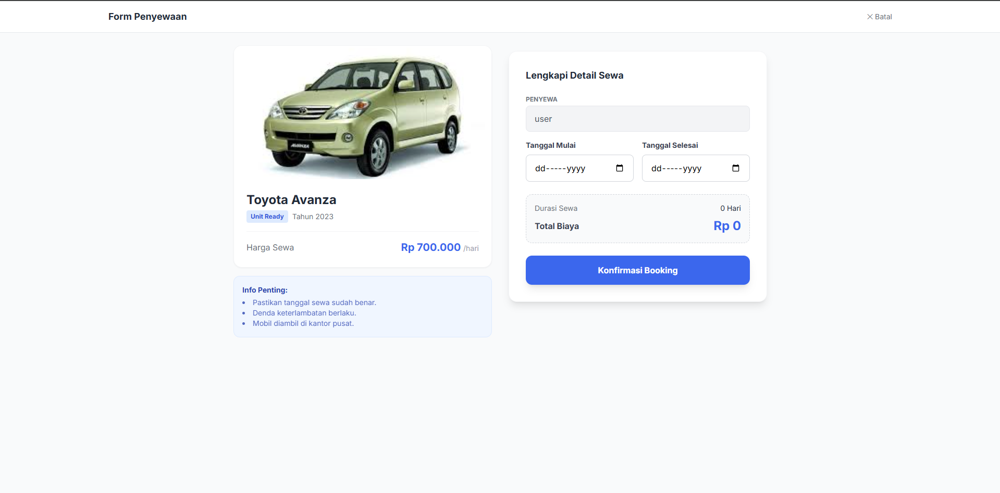
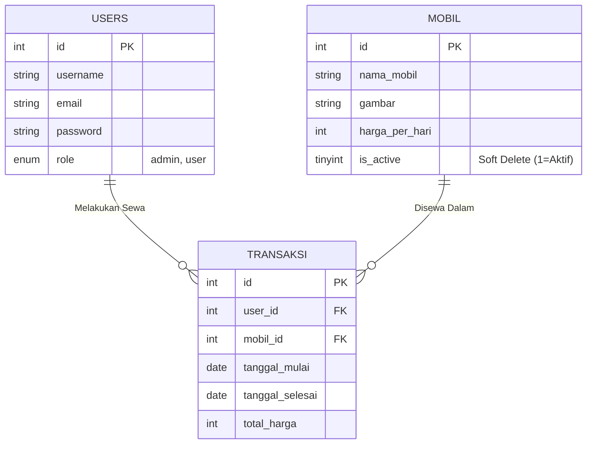

# 🚗 Sistem Informasi Rental Mobil (Car Rental)

Aplikasi berbasis web untuk manajemen penyewaan mobil yang sederhana, responsif, dan modern. Dibangun menggunakan **PHP Native** dan **Tailwind CSS**.
Proyek ini mencakup fitur lengkap untuk **User** (Penyewa) dan **Admin** (Pengelola), mulai dari pemesanan, manajemen armada dengan sistem *Soft Delete*, hingga laporan transaksi. 

---

## 📸 Screenshots

| Dashboard Utama | Detail Mobil & Booking |
|:---:|:---:|
|  |  |
| *Tampilan Grid Mobil Responsif* | *Form Booking dengan Live Calculator* |

---


## 🔥 Fitur Unggulan

### 👤 User (Penyewa)
* **Autentikasi Modern:** Login & Register (Support **Google Login**).
* **Pencarian Mobil:** Live search tanpa reload halaman (AJAX).
* **Booking System:** Validasi tanggal sewa (tidak bisa pilih tanggal lampau).
  * Kalkulator harga otomatis (Real-time).
* **Riwayat Transaksi:** Melihat status pesanan (Aktif/Selesai) dalam tampilan responsif (Card view di HP).

### 🛡️ Admin (Pengelola)
* **Dashboard Admin:** Ringkasan data.
* **Manajemen Mobil (CRUD):**
    * Tambah/Edit Mobil dengan **Live Preview Image**.
* **Soft Delete:** Menghapus mobil tanpa menghilangkan riwayat transaksi.
* **Manajemen Transaksi:** Melihat seluruh pesanan masuk.

---

## 🛠️ Teknologi yang Digunakan

* **Backend:** PHP (Native / Procedural)
* **Database:** MySQL
* **Frontend:** HTML5, Tailwind CSS (via CDN)
* **Scripting:** JavaScript (DOM Manipulation, AJAX, Fetch API)
* **Library Lain:** Google API Client (untuk Login Google)

---

## 💾 Skema Database (ERD)

Berikut adalah alur hubungan antar tabel dalam database:


## 🚀 Cara Instalasi (Localhost)

Ikuti langkah ini untuk menjalankan proyek di komputer Anda:

### 1. Persiapan Database
* Buka **phpMyAdmin.**
* Buat database baru bernama `db_carter`.
* Import file `db_carter.sql`
  
### 2. Konfigurasi Proyek
* Clone repository ini atau download ZIP.
  ```bash
  git clone https://github.com/Sulistiawan5/carter-mobil.git
  ```
* Pindahkan folder ke htdocs (jika menggunakan XAMPP) atau folder www (jika menggunakan Laragon).
* Pastikan file `koneksi.php` sesuai dengan settingan MySQL Anda:
  ```PHP
  $conn = mysqli_connect("localhost", "root", "", "db_carter");
  ```
### 3. Konfigurasi Google Login (Opsional)
Jika ingin fitur Google Login bekerja:
* Dapatkan Client ID dan Client Secret dari [Google Cloud Console](https://console.cloud.google.com/).
* Masukkan kredensial Anda ke file `.env_example`.
* Pastikan library Google Client sudah terinstall via Composer (jika pakai).

  ## 🔐 Akun Demo
  
  Gunakan akun berikut untuk pengujian:
  | Role | Email | Password|
  |:---:|:---:|:---:|
  | Admin | admin@carter.com | admin123 |
  | User | user@carter.co | user123 |

  ## 📂 Struktur Folder

Berikut adalah susunan folder dan file dalam proyek ini:

```text
carter-mobil/
├── 📂 assets/              # Menyimpan screenshot aplikasi untuk README
│   ├── dashboard.png
│   └── booking.png
├── 📂 components/          # Potongan kode yang dipakai berulang
│   └── card_mobil.php      # Tampilan kartu mobil (Grid/List)
├── 📂 uploads/            # Tempat gambar mobil yang diupload admin tersimpan
├── 📄 .env_example        # untuk memasukkan Client ID dan Client Screet
├── 📄 admin_edit.php       # Form edit data mobil
├── 📄 admin_hapus.php      # Logika soft delete mobil
├── 📄 admin_tambah.php     # Form tambah mobil baru
├── 📄 ajax_cari.php        # Logika pencarian mobil live (AJAX)
├── 📄 booking.php          # Halaman form penyewaan mobil
├── 📄 config_google.php    # Konfigurasi Login dengan Google
├── 📄 database.sql         # File backup database (untuk diimport )
├── 📄 index.php            # Halaman Utama / Dashboard
├── 📄 koneksi.php          # File koneksi ke database MySQL
├── 📄 login.php            # Halaman Login
├── 📄 logout.php           # Script logout
├── 📄 process_booking.php  # Logika pemrosesan sewa ke database
├── 📄 register.php         # Halaman Pendaftaran User
├── 📄 transaksi.php        # Halaman Riwayat & Laporan Transaksi
└── 📄 README.md            # Dokumentasi proyek ini
```

## 🤝 Kontribusi

Proyek ini dibuat untuk tujuan pemenuhan tugas `UAS` mata kuliah `Pengembangan Aplikasi Basis Data`. Silakan fork dan kembangkan sesuai kebutuhan.
